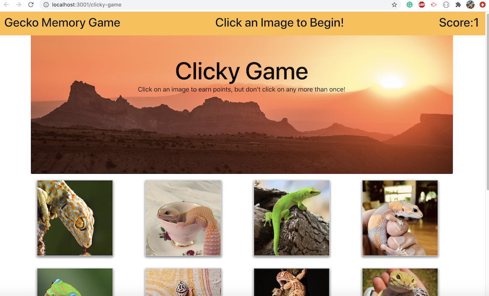
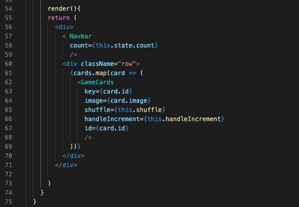
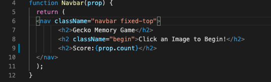

# Clicky-Game

This is a memory game where to goal is to not click on any one pictures twice, score is kept by increasing when the user correctly selects different images and resetting the score to zero if the user clicks on one image twice. 




## Table of Content
- Objective
- Deploy Link
- Getting Started
- Code Highlights
- Technology
- Author 

## Objective

The goal of this app is to create a memory game with React. This app will require breaking up the application's UI into components, manage component state, and respond to user events.

## Deploy Link

https://ayladillis.github.io/clicky-game/

## Getting Started
These instructions will get you a copy of the project up and running on your local machine for development and testing purposes. See deployment for notes on how to deploy the project on a live system.

```
$ git clone git@github.com:ayladillis/clicky-game.git
ayladillis/clicky-game.git
$ cd ayladillis/clicky-game.git
```
Then open in your preferred text editor:
- [vim](https://www.vim.org/) 
- [emmacs](https://www.gnu.org/software/emacs/)
- [visual studio code](https://code.visualstudio.com/) 

## Code Highlight

The render function on line 54 returns the Navbar, which keeps score as well as the GameCard which has an attachment of key, image, shuffle, handleIncrement and id. The card.id is how the images are shuffled. 



The navbar function on line 4 returns the entire fixed navbar and on line 9 in the h2 tag an object of prop.count is calling the score. 




## Technology
* [HTML](https://developer.mozilla.org/en-US/docs/Web/HTML)
* [CSS](https://developer.mozilla.org/en-US/docs/Web/CSS)
* [Javascript](https://developer.mozilla.org/en-US/docs/Web/JavaScrip)
* [React](https://reactjs.org/)
* [Github-Pages](https://pages.github.com/)


## Author
### [Ayla Dillis](https://github.com/ayladillis)
- [LinkedIn](https://www.linkedin.com/in/ayladillis/)
- [Portfolio](https://polar-falls-52203.herokuapp.com/)
- [Highlighted-Work](https://ayladillis.github.io/Coding-Bootcamp-Project-1-Zillow-Maps-API-AD/)
- email: aayladillis@gmail.com